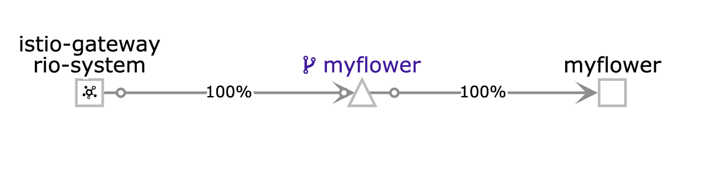
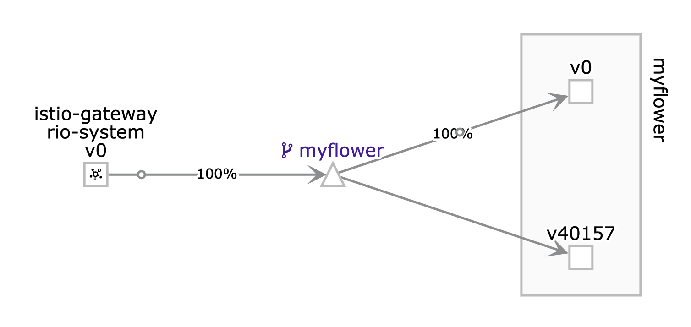

# Rio Demo

The article is intended to give an introduction to Rio by way of example. Certain featurs of Rio will be demonstrated. This article is writen in a way that it can double as a turoral.  You are invited to follow alonge.

## Rio Concepts

To understand Rio we will need to understand a few basic Rio concepts:

* **Service** – Scalable set of containers that provide a similar function.
* **App** – Contains multiple service revisions.  Each revision gets it’s own DNS name. 
* **Router** – Virtual service that routes and load balances traffic. Rules based on hostname, path, headers, protocol & source.
* **External Service** – A way of registering external IPs or hostnames into the service mesh such that they may be accessed via short name.
* **Public Domain** – Another phrase for vanity domain, e.g. www.myservice.org
* **Service Mesh** – Istio service mesh, deployed for securing, routing, monitoring, and controlling inter- and intra- service traffic.

## Service Mesh

A *service mesh* is a large topic one that we can not adequately cover here, see the [Istio Docs](https://istio.io/docs/concepts/what-is-istio/) for more information. However, it is worth pointing out a few key featrue so that we can understand better what is happening.

Istio will install a proxy on each pod. The proxy implements L7 routing which enables Isto to implment certain features such as:

* circuit breakers
* policy enforcement
* metrics collection and reporting

All traffic entering and leaving the pod is routed via the proxy without requiring any application changes


## Prerequisites

To run the demo you will need the following:

* A Kubernetes 1.13 or newer cluster running. I am using [Docker Desktop](https://docs.docker.com/docker-for-mac/install/) to host a cluster on my Mac.
* The `kubectl` CLI installed and pointed at your cluster. See the [Kubernetes official doc](https://kubernetes.io/docs/tasks/tools/install-kubectl/) for install and setup instructions.
* The `hey` program used for load testing. See [the hey GitHub page](https://github.com/rakyll/hey) for install instructions.
* The Rio CLI. The install instruction can be found on [the Rio GitHub page](https://github.com/rancher/rio).  
  ```
  # Download the CLI (available for macOS, Windows, Linux)
  curl -sfL https://get.rio.io | sh -   # or manually from https://github.com/rancher/rio/releases

  # Setup your cluster for Rio
  rio install

  # Make sure all the pods are up and running. These takes several minutes.
  kubectl get po -n rio-system

  # Check the status
  rio ps
  rio console
  rio info
  ```

## Demo Containers

To get started we need a few docker containers to use in our demo. For this purpose we will build a few images and store them in our local container registry. Start by cloning this repo.  All command in this article assume you are in the project root folder.

Build the docker images:

```bash
$ docker build \
  --build-arg COLOR=yellow \
  --build-arg VARIETY=sunflower \
  -t flower:yellowsun .

$ docker build \
  --build-arg COLOR=blue \
  --build-arg VARIETY=sunflower \
  -t flower:bluesun .
```

The above commands will build two docker images that are used throught this demo. The images are:

* `flower:yellowsun` - will listen on port 8080 and respond to any GET request with the following JSON document:

  ```json
  {
    "Variety": "sunflower",
    "Color": "yellow"
  }
  ```
* `flower:bluesun` - will listen on port 8080 and respond to any GET request with the following JSON document:

  ```json
  {
    "Variety": "sunflower",
    "Color": "blue"
  }
  ```

Now let's test our images before we jump into Rio, just to be sure all is good. Use `docker run` to create a container and in a second terminal (or in your browser) issue an HTTP GET to your service.

```bash
$ docker run -it --rm -p 8080:8080 flower:yellowsun
$ curl http://localhost:8080
{"Variety":"sunflower","Color":"yellow"}
```

Do the same for the second image

```bash
$ docker run -it --rm -p 8080:8080 flower:bluesun
$ curl http://localhost:8080
{"Variety":"sunflower","Color":"blue"}
```

## Demo Display Setup

In order to follow the script below you will need to arange several terminal windows and a browser window so that all are visable on your desktop.

* *Terminal-1* - Use to `watch rio ps`.  This command will display the service endpoints and information about the current revision, scale and weight.
* *Terminal-2* - Command terminal use to issue commans throught our demo
* *Browser* - Used to show display this README, Kailai UI and other UIs throught the demo.  To get the Kailai UI run `rio -s ps` and copy the Kailai URL into your browser. The default user name is *admin* and the default password is *admin*

Go ahead and initialize *Terminal-1* as shown below. Unless otherwise specified, use *Terminal-2* to run all other commands.

```bash
# in Terminal-1
$ watch rio ps
```

> TODO-screen-shot

## Create a Rio Service

To create a Rio service in your kubernetes cluster use the `rio run` command as shown below. Before continuning be sure you stop all the containers from above.

```bash
# A create a new service
$ rio run --ports 8080/http --name myflower flower:yellowsun
default/myflower:v0

```

The following is sample output from `rio ps` running in *Terminal-1*

```bash
Name               CREATED          ENDPOINT                                         REVISIONS   SCALE     WEIGHT    DETAIL
default/myflower   27 seconds ago   https://myflower-default.a4m7af.on-rio.io:9443   v0          1         100%

```

Using the endpoint URL displayed above let's test our service.

```bash
$ curl https://myflower-default.a4m7af.on-rio.io:9443
{"Variety":"sunflower","Color":"yellow"}
```

Let's try pasting the endpoint URL into out browser. Notice that the TLS cert is valid.


## Auto scale a service

Now let's use our containers to explore the auto scale features of Rio.  

Note, we will use `hey` to put load on our service, however it does not support TLS so the unsecure URL `http://myflower-default.a4m7af.on-rio.io:9080` is used instead.

```bash
# Add load, make 60 requests concurrently for 1 minutes
$ hey -z 1m -c 60 http://myflower-default.a4m7af.on-rio.io:9080
```

Watch the output in *Terminal-1* where we are watching `rio ps` 

```bash
# timestamp 1 - start load
Name               CREATED          ENDPOINT                                         REVISIONS   SCALE     WEIGHT    DETAIL
default/myflower   22 minutes ago   https://myflower-default.a4m7af.on-rio.io:9443   v0          1         100%      

# timestamp 2 - SCALEs up under load
Name               CREATED          ENDPOINT                                         REVISIONS   SCALE     WEIGHT    DETAIL
default/myflower   23 minutes ago   https://myflower-default.a4m7af.on-rio.io:9443   v0          3         100%      

# timestamp 3 - SCALEs up some more under load
Name               CREATED          ENDPOINT                                         REVISIONS   SCALE     WEIGHT    DETAIL
default/myflower   23 minutes ago   https://myflower-default.a4m7af.on-rio.io:9443   v0          6         100%      

# timestamp 4 - no more load for awhile, SCALE down starting
Name               CREATED          ENDPOINT                                         REVISIONS   SCALE     WEIGHT    DETAIL
default/myflower   25 minutes ago   https://myflower-default.a4m7af.on-rio.io:9443   v0          4         100%      

# timestamp 5 - eventually we SCALE down to 1
Name               CREATED          ENDPOINT                                         REVISIONS   SCALE     WEIGHT    DETAIL
default/myflower   26 minutes ago   https://myflower-default.a4m7af.on-rio.io:9443   v0          1         100%      

```

Here is how the service *graph* looks in Kiali.  Use `rio -s ps` to display the Kiali URL, in my case `https://kiali-rio-system.a4m7af.on-rio.io:9443/`

Kiali setings:

* Graph Type
  * App
* Filter
  * name != myflower
* Edge Labels
  * Requests percent of total
* Display
  * Traffic Animation
* Fetching
  * last min
  * every 5 sec



## Canary Deployment

In Rio, an **applicaton** contains multiple service revisions. The `rio stage` command is simular to the `rio run` command in that they both will create a service, however the `rio run` command will create an application and associate it with its first and only service. The `rio stage` will simply associate a new service revision to an existing application. Therefore the command shown below will:

* create a new service revision based on the `flower:bluesun`  image
* associate the revision with the `myflower` application with an initial weight of 0%, meaning it receives 0% of the application's traffic
* however it will create a new URL for the revision that is functional. This allows for testing before the new revision goes live.

```bash
# Stage a new version
$ rio stage --image=flower:bluesun myflower
```

To review an application's revision use the `rio revision` command.

```bash
$ rio revision myflower
Name                      IMAGE              CREATED             SCALE     ENDPOINT                                                WEIGHT    DETAIL
default/myflower:v89262   flower:bluesun     24 minutes ago      1         https://myflower-v89262-default.a4m7af.on-rio.io:9443   0         
default/myflower:v0       flower:yellowsun   About an hour ago   1         https://myflower-v0-default.a4m7af.on-rio.io:9443       100       
```

Our initial revision `myflower:v0` is based on the `flower:yellowsun` image and will receive all of the appliction's traffic. The revision `myflower:v89262` is the one we just staged. I am not sure how the version numbers are determined, I woud have expected `v1`. At any rate we see revision has a unique URL and the `myflower` application too has its own URL. Let's see what we get when we hit each endpoint.

```bash
# the initial revision
$ curl https://myflower-v0-default.a4m7af.on-rio.io:9443 
{"Variety":"sunflower","Color":"yellow"}

# the second revision
curl https://myflower-v89262-default.a4m7af.on-rio.io:9443
{"Variety":"sunflower","Color":"blue"}

# The application returns "yellow" because the weight of the initial revision is 100%
$ curl https://myflower-default.a4m7af.on-rio.io:9443
{"Variety":"sunflower","Color":"yellow"}
```

Here is how it looks in Kiali if we switch to graph type of "versiond app":



Now we are ready to promote our new revision and make it live. The `rio promote` command is used for this and it will gradually shift traffic over to the new revision. By default it will apply a 5% shift every 5 seconds.

```bash
# Promote service
$ rio promote myflower:v89262
$ hey -z 3m -c 30 http://myflower-default.a4m7af.on-rio.io:9080


Name               CREATED       ENDPOINT                                         REVISIONS   SCALE     WEIGHT    DETAIL
default/myflower   2 hours ago   https://myflower-default.a4m7af.on-rio.io:9443   v0,v89262   1,1       85%,15%   

Name               CREATED       ENDPOINT                                         REVISIONS   SCALE     WEIGHT    DETAIL
default/myflower   2 hours ago   https://myflower-default.a4m7af.on-rio.io:9443   v0,v89262   1,1       75%,25%   

Name               CREATED       ENDPOINT                                         REVISIONS   SCALE     WEIGHT    DETAIL
default/myflower   2 hours ago   https://myflower-default.a4m7af.on-rio.io:9443   v0,v89262   1,1       65%,35%   

Name               CREATED       ENDPOINT                                         REVISIONS   SCALE     WEIGHT    DETAIL
default/myflower   2 hours ago   https://myflower-default.a4m7af.on-rio.io:9443   v0,v89262   1,1       55%,45%   

Name               CREATED       ENDPOINT                                         REVISIONS   SCALE     WEIGHT    DETAIL
default/myflower   2 hours ago   https://myflower-default.a4m7af.on-rio.io:9443   v0,v89262   1,1       45%,55%   

Name               CREATED       ENDPOINT                                         REVISIONS   SCALE     WEIGHT    DETAIL
default/myflower   2 hours ago   https://myflower-default.a4m7af.on-rio.io:9443   v0,v89262   1,1       35%,65%   

Name               CREATED       ENDPOINT                                         REVISIONS   SCALE     WEIGHT    DETAIL
default/myflower   2 hours ago   https://myflower-default.a4m7af.on-rio.io:9443   v0,v89262   1,1       25%,75%   

Name               CREATED       ENDPOINT                                         REVISIONS   SCALE     WEIGHT    DETAIL
default/myflower   2 hours ago   https://myflower-default.a4m7af.on-rio.io:9443   v0,v89262   1,1       15%,85%  

Name               CREATED       ENDPOINT                                         REVISIONS   SCALE     WEIGHT    DETAIL
default/myflower   2 hours ago   https://myflower-default.a4m7af.on-rio.io:9443   v0,v89262   1,1       5%,95%

Name               CREATED       ENDPOINT                                         REVISIONS   SCALE     WEIGHT    DETAIL
default/myflower   2 hours ago   https://myflower-default.a4m7af.on-rio.io:9443   v89262      1         100%
```


```bash
# Manually adjusting weight between revisions
$ rio weight myflower:v0=5% myflower:v89262=95%
$ rio weight myflower:v0=50% myflower:v89262=50%
$ rio weight myflower:v0=0% myflower:v89262=100%
```

## What just happened

* We created a new service using `rio run`
* Rio generated a domain name for the service
* Rio secured the service for us using Let’s Encrypt
* When we added load, Rio scaled the service up for us
* When we removed load, Rio scaled the service down for us. 
* When we installed a new revision, Rio automatically moved traffic to the newest app revision for us.


## Serverless

```bash
# for show
[terminal 1] watch rio ps
[terminal 2] watch kubectl get pods
[terminal 3]
rio run -p 8080/http --name hi-service --scale=0-10 hi:blue
rio scale hi-service=1
rio scale hi-service=2
rio scale hi-service=3
curl <service endpoint url>
rio scale hi-service=0-3
curl <service endpoint url>
```


## Adding Router

## Monitoring


## backup

```bash
rio run -p 8080/http --name rdemo monachus/rancher-demo:yellow
rio scale default/rdemo=1-5
rio scale default/rdemo=3
rio stage --image=monachus/rancher-demo:pink default/rdemo:v1
rio weight --rollout-interval 2 default/rdemo:v1=25
rio promote --rollout-interval 2 default/rdemo:v1

$ siege -c10
https://www.linode.com/docs/tools-reference/tools/load-testing-with-siege/
```