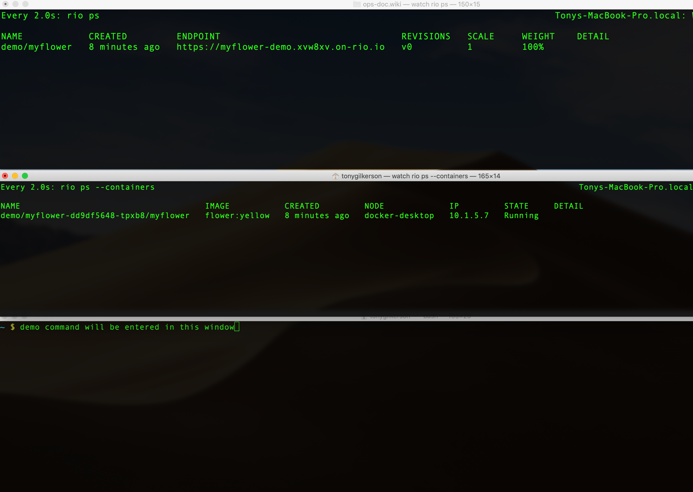

# Rio Demo

The article is intended to give an introduction to Rio by way of example. Certain features of Rio will be demonstrated. This article is written in a way that it can double as a turoral.  You are invited to follow alonge.

## Rio Concepts

Rio is a MicroPaaS that can be layered on top of any standard Kubernetes cluster. To understand Rio we will need to understand a few basic Rio concepts:

* **Service** – Scalable set of containers that provide a similar function.
* **App** – Contains multiple service revisions.  Each revision gets it’s own DNS name. 
* **Router** – Virtual service that routes and load balances traffic. Rules based on hostname, path, headers, protocol & source.
* **External Service** – A way of registering external IPs or hostnames into the service mesh such that they may be accessed via short name.
* **Service Mesh** – Istio service mesh, deployed for securing, routing, monitoring, and controlling inter- and intra- service traffic.

## Service Mesh

A *service mesh* is a large topic one that we can not adequately cover here, see the [Istio Docs](https://istio.io/docs/concepts/what-is-istio/) for more information. However, it is worth pointing out a few key featrue so that we can understand better what is happening.

Istio will install a proxy on each pod, a "sidecar". The proxy implements L7 routing which enables Isto to implment certain features such as:

* circuit breakers
* policy enforcement
* metrics collection and reporting
* security
  * defend against *man-in-the-middle* attack
  * service access control
  * audit who did what at what time


All traffic entering and leaving the pod is routed via the proxy without requiring any application changes


## Prerequisites

To run the demo you will need the following:

* A Kubernetes 1.13 or newer cluster running. I am using [Docker Desktop](https://docs.docker.com/docker-for-mac/install/) to host a cluster on my Mac
* The `kubectl` CLI installed and pointed at your cluster. See the [Kubernetes official doc](https://kubernetes.io/docs/tasks/tools/install-kubectl/) for install and setup instructions
* The `hey` program used for load testing. See [the hey GitHub page](https://github.com/rakyll/hey) for install instructions
* The *Rio CLI*. The install instruction can be found on [the Rio GitHub page](https://github.com/rancher/rio)  

```bash
# Download the CLI (available for macOS, Windows, Linux)
curl -sfL https://get.rio.io | sh -   

# Install Rio into the cluster
# Using service loadbalancer (mode=svclib) because my cluster does have an ingress
$ rio  install --mode svclib

Deploying Rio control plane....
rio controller version v0.4.0 (a8d35ef9) installed into namespace rio-system
Detecting if clusterDomain is accessible...
ClusterDomain is reachable. Run `rio info` to get more info.
Controller logs are available from `rio systemlogs`

Welcome to Rio!

Run `rio run https://github.com/rancher/rio-demo` as an example
  

# Check the status
$ rio info
Rio Version: v0.4.0 (a8d35ef9)
Rio CLI Version: v0.4.0 (a8d35ef9)
Cluster Domain: xvw8xv.on-rio.io
Cluster Domain IPs: 127.0.0.1
System Namespace: rio-system

System Components:
Autoscaler status: running
BuildController status: running
CertManager status: running
Grafana status: running
IstioCitadel status: running
IstioPilot status: running
IstioTelemetry status: running
Kiali status: running
Prometheus status: running
Registry status: running
Webhook status: running

# The rio console is a text basse UI (TUI)
rio console
```

## Demo Containers

To get started we need a few docker containers to use in our demo. For this purpose we will build a few images and store them in our local container registry. Start by cloning this repo.  All command in this article assume you are in the project root folder.

Build the docker images:

```bash
$ git clone https://github.com/MileTwo/riodemo.git
$ cd riodemo
$ docker build --build-arg COLOR=yellow -t flower:yellow .
$ docker build --build-arg COLOR=blue   -t flower:blue .
$ docker build --build-arg COLOR=red    -t flower:red .
```

The above commands will build a few docker images that are used throught this demo. The same simple [golang program](https://github.com/MileTwo/riodemo/blob/master/src/main.go) is use in each image. The program will responds to any http request with the color sepcified in the environment varable.

Let's test our images before we jump into Rio, just to be sure all is good. Use `docker run` to create a container and in a second terminal (or in your browser) issue an HTTP GET to your service.

```bash
$ docker run -it --rm -p 8080:80 flower:yellow
$ curl http://localhost:8080
{"Color":"yellow"}
^C

$ docker run -it --rm -p 8080:80 flower:blue
$ curl http://localhost:8080
{"Color":"blue"}
^C

$ docker run -it --rm -p 8080:80 flower:red
$ curl http://localhost:8080
{"Color":"red"}
^C
```

## Demo Display Setup

In order to follow the script below you may want to arange several terminal windows and a browser window so that all are visable on your desktop.

* Desktop 1
  * *Terminal-1* - Use to run `watch rio ps`.  This command will display the service endpoints and information about the current revision, scale and weight.
  * *Terminal-2* - Use to run `watch rio ps --containers`.  This command will display our service containers and the docker image they are based on.
  * *Terminal-3* - Command terminal use to issue commans throughout our demo
* Desktop 2
  * *Browser* - Used to view this README, the Kailai and Grafana UIs throughout the demo.  To get the URLs for Kailai and Grafana run `rio -s ps`. The default user name is *admin* and the default password is *admin*

Your setups should look something like this:




## Create a Rio Service

To create a Rio service in your kubernetes cluster use the `rio run` command as shown below. Before continuning be sure you stop all the containers from above.

```bash
# create a new service
$ rio run --ports 80/http --name demo/myflower flower:yellow
demo/myflower:v0

```

This `rio run` command created a service called `myflower` in the `demo` namespace. The service is an instance of the `flower:yellow` docker image. The following is sample output from `rio ps` running in *Terminal-1*

```bash
Name               CREATED          ENDPOINT                              REVISIONS   SCALE     WEIGHT    DETAIL
demo/myflower   27 seconds ago   https://myflower-demo.xvw8xv.on-rio.io   v0          1         100%

```

Using the endpoint URL displayed above let's test our service.

```bash
$ curl https://myflower-demo.xvw8xv.on-rio.io
{"Color":"yellow"}
```

Let's try pasting the endpoint URL into out browser. Notice that the TLS cert is valid.


Let's see what it looks like in Kiali

```bash
rio -s ps

#looks for
https://kiali-rio-system.3lzq3l.on-rio.io 
```


## Auto scale a service

Let's explore the auto scale features of Rio using the service we just created. Rio will default the service scale to min=1 and max=10 containers. Use the `rio inspect` to view the scaling properties.

```bash
$ rio inspect demo/myflower

...
spec:
  concurrency: 10
  image: flower:yellow
  imagePullPolicy: IfNotPresent
  maxScale: 10
  minScale: 1
...
```

We will use `hey` to put load on our service, however it does not support TLS so the unsecure URL `http://myflower-demo.xvw8xv.on-rio.io` is used instead.

```bash
# Add load, make 60 requests concurrently for 1 minutes
$ hey -z 1m -c 60 http://myflower-demo.xvw8xv.on-rio.io
```

Watch the output in *Terminal-1*  where we are displaying `rio ps` and take note of the `SCALE` column. 

```bash
# timestamp 1 - start load
Name            CREATED          ENDPOINT                                 REVISIONS   SCALE     WEIGHT    DETAIL
demo/myflower   22 minutes ago   https://myflower-demo.xvw8xv.on-rio.io   v0          1         100%

# timestamp 2 - SCALEs up under load
Name            CREATED          ENDPOINT                                 REVISIONS   SCALE     WEIGHT    DETAIL
demo/myflower   23 minutes ago   https://myflower-demo.xvw8xv.on-rio.io   v0          3         100%

# timestamp 3 - SCALEs up some more under load
Name            CREATED          ENDPOINT                                 REVISIONS   SCALE     WEIGHT    DETAIL
demo/myflower   23 minutes ago   https://myflower-demo.xvw8xv.on-rio.io   v0          7         100%

# timestamp 4 - no more load for awhile, SCALE down starting
Name            CREATED          ENDPOINT                                 REVISIONS   SCALE     WEIGHT    DETAIL
demo/myflower   25 minutes ago   https://myflower-demo.xvw8xv.on-rio.io   v0          4         100%

# timestamp 5 - eventually we SCALE down to 1
Name            CREATED          ENDPOINT                                 REVISIONS   SCALE     WEIGHT    DETAIL
demo/myflower   26 minutes ago   https://myflower-demo.xvw8xv.on-rio.io   v0          1         100%

```

Here is what it looked like in *Terminal-2* where we are displaying `rio ps --containers` Notice that the number of containers correspondes to the `SCALE` above:

```bash
# timestamp 1 - start load
NAME                                     IMAGE           CREATED          NODE             IP         STATE     DETAIL
demo/myflower-dd9df5648-tpxb8/myflower   flower:yellow   25 minutes ago   docker-desktop   10.1.5.7   Running

# timestamp 3 - SCALEs up some more under load
NAME                                     IMAGE           CREATED              NODE             IP          STATE     DETAIL
demo/myflower-dd9df5648-b5wz7/myflower   flower:yellow   About a minute ago   docker-desktop   10.1.5.12   Running
demo/myflower-dd9df5648-j9zlx/myflower   flower:yellow   About a minute ago   docker-desktop   10.1.5.9    Running
demo/myflower-dd9df5648-lmm4m/myflower   flower:yellow   About a minute ago   docker-desktop   10.1.5.10   Running
demo/myflower-dd9df5648-mmbp9/myflower   flower:yellow   About a minute ago   docker-desktop   10.1.5.8    Running
demo/myflower-dd9df5648-mwkc9/myflower   flower:yellow   21 seconds ago       docker-desktop   10.1.5.13   Running
demo/myflower-dd9df5648-rmbnf/myflower   flower:yellow   About a minute ago   docker-desktop   10.1.5.11   Running
demo/myflower-dd9df5648-tpxb8/myflower   flower:yellow   25 minutes ago       docker-desktop   10.1.5.7    Running

# timestamp 5 - eventually we SCALE down to 1
NAME                                     IMAGE           CREATED          NODE             IP         STATE     DETAIL
demo/myflower-dd9df5648-tpxb8/myflower   flower:yellow   27 minutes ago   docker-desktop   10.1.5.7   Running
```


Here is how the service *graph* looks in Kiali.  Use `rio -s ps` to display the Kiali URL, in my case `https://kiali-rio-system.xvw8xv.on-rio.io`

Kiali setings:

* Graph Type
  * App
* Namespace
  * demo
* Edge Labels
  * Requests percent of total
* Display
  * Traffic Animation
* Fetching
  * last min
  * every 5 sec


## Canary Deployment

In Rio, an **applicaton** contains multiple service revisions. The `rio stage` command is used to associate a new service revision to an existing application. Therefore the command shown below will:

* create a new service revision based on the `flower:blue`  image
* associate the revision with the `myflower` application with an initial weight of 0%, meaning it receives 0% of the application's traffic
* however it will create a new URL for the revision that is functional. This allows for testing before the new revision goes live.

```bash
# Stage a new version
$ rio stage --image=flower:blue demo/myflower
```

To review an application's revision use the `rio revision` command.

```bash
$ rio revision demo/myflower
Name                   IMAGE           CREATED             SCALE     ENDPOINT                                        WEIGHT    DETAIL
demo/myflower:v40157   flower:blue     24 minutes ago      1         https://myflower-v40157 -demo.xvw8xv.on-rio.io   0         
demo/myflower:v0       flower:yellow   About an hour ago   1         https://myflower-v0-demo.xvw8xv.on-rio.io       100       
```

Our initial revision `myflower:v0` is based on the `flower:yellow` image and will receive all of the appliction's traffic. The revision `myflower:v40157 ` is the one we just staged. I am not sure how the version numbers are determined, I woud have expected `v1`. At any rate we see this revision has a unique URL and the `myflower` application too has its own URL. Let's see what we get when we hit each endpoint.

```bash
# the initial revision
$ curl https://myflower-v0-demo.xvw8xv.on-rio.io
{"Color":"yellow"}

# the second revision
curl https://myflower-v40157 -demo.xvw8xv.on-rio.io
{"Color":"blue"}

# The application returns "yellow" because the weight of the initial revision is 100%
$ curl https://myflower-demo.xvw8xv.on-rio.io
{"Color":"yellow"}
```

Eventhough each revision has its own URL and can be directly accesed by other services this is not the intention.  The idea is to access the appliction and let it decide based on its routing rules which revision to use.

Here is how it looks in Kiali if we switch to graph type of "versiond app":


This screen shot helps make clear the Rio concepts of **application** and **service**.  An application contains multiple service revisions and a service is a scalable set of containers.  In kubernetes terms you can think of a service as a deployment but an application does not really have a kubernetes equvilent. It is a meta object used to enable additional Rio functionality.


Now we are ready to promote our new revision and make it live. The `rio promote` command is used for this and it will gradually shift traffic over to the new revision. By default it will apply a 5% shift every 5 seconds.

```bash
# Promote service
$ rio promote demo/myflower:v40157 
$ hey -z 3m -c 30 http://myflower-demo.xvw8xv.on-rio.io

# timestamp 1 - Trffic is swiching over to v40157  it is receiving 15%
Name            CREATED       ENDPOINT                                 REVISIONS   SCALE     WEIGHT    DETAIL
demo/myflower   2 hours ago   https://myflower-demo.xvw8xv.on-rio.io   v0,v40157    1,1       85%,15%

# timestamp 2 - Trffic is swiching over to v40157  it is receiving 35%
Name            CREATED       ENDPOINT                                 REVISIONS   SCALE     WEIGHT    DETAIL
demo/myflower   2 hours ago   https://myflower-demo.xvw8xv.on-rio.io   v0,v40157    1,1       65%,35%

# timestamp 3 - Trffic is swiching over to v40157  it is receiving 55%
Name            CREATED       ENDPOINT                                 REVISIONS   SCALE     WEIGHT    DETAIL
demo/myflower   2 hours ago   https://myflower-demo.xvw8xv.on-rio.io   v0,v40157    1,1       45%,55%

# timestamp 4 - Trffic is swiching over to v40157  it is receiving 75%
Name            CREATED       ENDPOINT                                 REVISIONS   SCALE     WEIGHT    DETAIL
demo/myflower   2 hours ago   https://myflower-demo.xvw8xv.on-rio.io   v0,v40157    1,1       25%,75%

# timestamp 5 - Trffic is swiching over to v40157  it is receiving 95%
Name            CREATED       ENDPOINT                                 REVISIONS   SCALE     WEIGHT    DETAIL
demo/myflower   2 hours ago   https://myflower-demo.xvw8xv.on-rio.io:  v0,v40157    1,1       5%,95%

# timestamp 6 - promotion complete 100% of the traffic is directed at v40157 
Name            CREATED       ENDPOINT                                 REVISIONS   SCALE     WEIGHT    DETAIL
demo/myflower   2 hours ago   https://myflower-demo.xvw8xv.on-rio.io   v40157       1         100%
```

Here is what the promotion looks like in the Kiali UI. Just like above at each point we see the traffic switching over to `v40157` revision until it reaches 100%

> timestamp 1


> timestamp 2


> timestamp 3


> timestamp 4


Grafana has several out-of-the-box dashboards for Istio.  Here is a sample Istio Performance Dashboard for our service mesh:


In some cases we don't want to promote right away but instead we can choose to set the weights manually. Perhaps we want to give our new version 5% of the traffic and then watch it for a few days before so we can gain confidence that all is good before we promote. 

Below are a few examples of how to set the weights manually:

```bash
# Manually adjusting weight between revisions
$ rio weight demo/myflower:v0=80% demo/myflower:v40157 =20%
```

## What just happened

* We created a new service using `rio run`
* Rio generated a domain name for the service `xvw8xv.on-rio.io`
* Rio secured the service for us using Let’s Encrypt
* When we added load, Rio scaled the service up for us
* When we removed load, Rio scaled the service down for us
* When we installed a new revision, Rio automatically moved traffic to the newest app revision for us

That is alot of functionality and all we had to do was crate our docker images and issue a few Rio commands!

## Serverless

In this context serverless referrs to a form of autoscaling. It is the ability for a service to scale down to zero instances when there is no workload and then automaticlly scale up when a new request is made.  

With a Rio service there are no language or execution time restrictions like the restrictions that can be found with some other serverless platforms. You are free to put anything you like in your container and the system will run it for as long as necessary. All you have to do is set the minimum and maximum autoscalling parameters and Rio will monitor the workload and scale it as neccessary. Consider a use case that would be dificult to accomplish on some serverless platforms. For example, some machine learning jobs want to allocate GPUs and take a long time to complete while at the same time are used infrequently.  With the ability to scale the ML services to zero instances the GPU resources can be freed up for other jobs to use.

Let's see autoscaling-to-zero in action.

Note that below we are creating a new service with scale 0 to 10 instances. Instead of creating a new service we should be able to modify our existing service but there is currently a bug in rio v0.4.0 that is preventing us from doing something like `rio scale demo/myflower=0-10`.  The Rio team is aware and I expect that by the time you read this it will be fixed.

```bash
# create new service with ability to scale from 0 to 10 instances
$ rio run --ports 80/http --scale=0-10 --name demo/myserverlessflower flower:yellow

# wait a couple of minutes for the workload to scale to zero
...

# list the active instances aka containers, and we see there are none
$ rio ps --containers
NAME      IMAGE     CREATED   NODE      IP        STATE     DETAIL


# list the services and notice we have a service endpoint eventhough there are no running service instances (SCALE 0/1
$ rio ps
NAME                      CREATED         ENDPOINT                                           REVISIONS   SCALE     WEIGHT    DETAIL
demo/myserverlessflower   2 minutes ago   https://myserverlessflower-demo.7u0o75.on-rio.io   v0          0/1       100%           

# make a service request and after a small "cold start" delay we see a response
$ curl https://myserverlessflower-demo.7u0o75.on-rio.io
{"Color":"yellow"}

# Now when we list the service we see the SCALE is 1
$ rio ps
NAME                      CREATED         ENDPOINT                                           REVISIONS   SCALE     WEIGHT    DETAIL
demo/myserverlessflower   6 minutes ago   https://myserverlessflower-demo.7u0o75.on-rio.io   v0          1         100%      

# And we now see one instance of the service is active
$ rio ps --containers
NAME                                                             IMAGE           CREATED          NODE             IP          STATE     DETAIL
demo/myserverlessflower-86d94bfd64-42bf4/myserverlessflower   flower:yellow   33 seconds ago   docker-desktop   10.1.4.83   Running 

```

In summary, serverless is just an autoscaling feature of Rio with the ability to scale to zero instances.

## Adding Router

Router is a set of L7 load-balancing rules that can route between your services. It can add Header-based, path-based routing, cookies and other rules. 

```bash
# create route
$ rio route add myflowerrt.demo to demo/myflower

# display route URL
$ rio route
NAME              URL                                        OPTS      ACTION    TARGET
demo/myflowerrt   https://myflowerrt-demo.3lzq3l.on-rio.io             to        myflower,port=80

# test route
$ curl https://myflowerrt-demo.3lzq3l.on-rio.io 
{"Color":"yellow"}

```

Example uses cases include:

* Create router in a different namespace
* Create a route based path match
* Create a route to a different port
* Create router based on header
* Create router based on cookies
* Create route based on HTTP method 
* Add, set or remove headers
* Mirror traffic
* Rewrite host header and path
* Redirect to another service
* Add fault injection
* Add retry logic
* Create router to different revision and different weight

In a future post we will take a closer look at Rio routing, for now you can see the [official Rio docs](https://github.com/rancher/rio/blob/master/docs/README.md#adding-router) for more information.

## Monitoring

We had a quick look at the Istio Performance Dashboard above but there is much more on monitoring and alerting that we will cover in a future post.  For now I will leave it to you to look around.

To access Grafana:

```bash
rio -s ps

#look for:
https://grafana-rio-system.3lzq3l.on-rio.io

```

## Rio File

The `rio run` command is powerful but just like the `docker run` command it can quickly get out of hand and hard to maintain all the command line parameters.  Therefore, Rio has added support for a more user-friendly docker-compose-style config file call Riofile. Riofile allows you define rio services, apps, routes, external services, configmap, and secrets. 

For more information see the [official Riod docs](https://github.com/rancher/rio/blob/master/docs/README.md#using-riofile) for more information.
